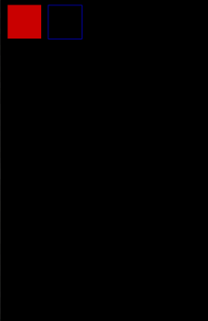

 Love2D port for J2ME powered devices
---

## 🚀 Features

- 🐍 Lua scripting support (via [luaj-jme](https://github.com/luaj/luaj))
- 📦 MIDlet-compatible runtime
- 🖼 Basic 2D graphics: `rectangle`, `line`, `circle`, etc.
- 🎮 Works on Series 40, Symbian, and Java-enabled phones
- 🧪 Tested on real devices

---

## 📸 Screenshots

| Drawing Rectangle |            
| ----------------- |           
|  |      

| Drawing Image |
| ----------------- |
|  |
---
## 💬 Contact
[Telegram channel](https://t.me/love_j2me)

## 📂 File Structure

```
Love4ME/
├── src/                  # Java source code
├── outputs/              # Compiled classes
├── outputs/game/         # Lua game scripts
│   └── main.lua
├── logo.png              # Project logo
└── README.md             # This file
```

---

## 🧠 Getting Started

### 🔧 Requirements

- Java ME SDK (e.g. **WTK 2.5.2**)
- `luaj-jme-3.0.2.jar`
- Basic knowledge of Lua and Java

### 🛠 Build

To build the project, simply run:

```bash
buildjar.bat
```

---

## 🧾 Sample Lua Script

```lua
function love.load()
    -- Initialization
end

function love.draw()
    love.graphics.rectangle("fill", 10, 10, 50, 50)
end
```

---

## 🧑‍💻 Credits

- [LÖVE2D](https://love2d.org/)
- [luaj](https://github.com/luaj/luaj)
- Java ME SDK by Sun Microsystems
- ❤️ Ported by *Monsler*

---

## 📜 License

This project is licensed under the MIT License. See [`LICENSE`](LICENSE) for details.
